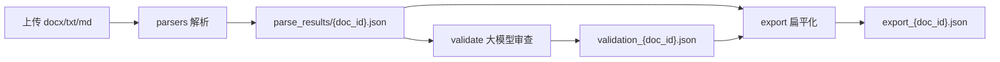

# 生成 JSON 文件的逻辑与相关文件

ReqCheck 中**生成 JSON** 的逻辑分三条线：**解析树**、**验证结果**、**导出扁平列表**。核心落盘在 `app/routes/`，解析树的数据结构由 `app/parsers/` 构建。

---

## 1. 解析结果 JSON（需求树）

**入口 API：** `GET /api/parse/<doc_id>`  
**落盘文件：** `local_workspaces/parse_results/{doc_id}.json`  
**缓存索引：** `local_workspaces/parse_results/cache_index.json`（内容哈希 → doc_id）

### 流程

```
上传文档
  → GET /api/parse/<doc_id>
  → parse_document_to_tree()        # 构建 Python dict 树
  → save_json_to_file()             # json.dump 写文件
  → _persist_parse_result()         # 同时写 SQLite RequirementTree
```

### 相关文件

| 文件 | 作用 |
|------|------|
| `app/routes/parse.py` | **写 JSON 的入口**：`save_json_to_file`、`_persist_parse_result`、`parse_document` |
| `app/parsers/pipeline.py` | **组装树**：`parse_document_to_tree()` |
| `app/parsers/extractors/*.py` | 从 txt/md/docx 提取 blocks |
| `app/parsers/preamble.py` | 跳过封面/目录 |
| `app/parsers/tree_builder.py` | blocks → 需求树 dict |
| `app/parsers/content_render.py` | 生成 `content_html`、`display_title` 等展示字段 |
| `app/parsers/section_registry.py` | 无编号标题映射（如 3.2.2） |
| `app/parsers/heading_detector.py` | 标题识别 |
| `app/parsers/asset_store.py` | 图片资产（非 JSON，但会写入树的 `images`） |
| `app/parsers/image_convert.py` | EMF → PNG |
| `app/parsers/models.py` | `DocumentBlock`、`TableData`、`ImageData` 数据结构 |
| `config.py` | `PARSE_RESULTS_FOLDER` 路径配置 |
| `app/services/workspace.py` | 工作区目录初始化 |

> 旧目录 `app/parse_results/` 是历史遗留，当前实际用的是 `local_workspaces/parse_results/`。

---

## 2. 验证结果 JSON

**入口 API：** `GET /api/validate/<doc_id>`（支持 `?force=1`）  
**落盘文件：** `local_workspaces/validate_results/validation_{doc_id}.json`  
**缓存索引：** `local_workspaces/validate_results/cache_index.json`

### 流程

```
读取 parse_results/{doc_id}.json
  → collect_nodes() + format_node_validation_content()
  → construct_validation_prompt() → 大模型
  → json.dump(validation_results)
  → 同时写 SQLite ValidationResult
```

### 相关文件

| 文件 | 作用 |
|------|------|
| `app/routes/validate.py` | **写验证 JSON**：`validate_requirements`、`validate_batch`、`construct_validation_prompt` |
| `appendices/438C-2021附录J.txt` | 规范规则来源（`build_rule_tree_from_file`） |
| `app/models.py` | `ValidationResult.result_json` |

---

## 3. 导出 JSON（扁平需求列表）

**入口 API：** `GET /api/export/<doc_id>`  
**落盘文件：** `local_workspaces/export_results/export_{doc_id}.json`

### 流程

```
读取 parse_results/{doc_id}.json
+ validation_{doc_id}.json（若有）
  → traverse_tree() 扁平化
  → json.dump(requirements)
```

### 相关文件

| 文件 | 作用 |
|------|------|
| `app/routes/export.py` | **写导出 JSON** |

---

## 4. 删除时清理 JSON

| 文件 | 作用 |
|------|------|
| `app/routes/upload.py` | 删除文档时移除 `parse_results`、`validate_results`、`export_results` 下的 JSON |

---

## 5. 数据流示意



---

## 6. 前端谁触发

| 前端 | 调用的 API |
|------|-----------|
| `frontend/src/views/ParseView.vue` | `/api/parse/<docId>` |
| `frontend/src/views/ValidateView.vue` | `/api/validate/<docId>` |
| `frontend/src/views/ReportView.vue` | `/api/export/<docId>` |
| `frontend/src/api/index.js` | 上述接口封装 |

---

## 7. 快速定位

| 关注点 | 重点文件 |
|--------|----------|
| 需求树 JSON 里每个字段怎么来的 | `app/parsers/pipeline.py` → `tree_builder.py` → `content_render.py` |
| 什么时候写 JSON 文件 | `app/routes/parse.py` 中的 `save_json_to_file`、`_persist_parse_result` |
| 验证 JSON 何时生成 | `app/routes/validate.py` 中的 `validate_requirements` |
| 导出 JSON 何时生成 | `app/routes/export.py` 中的 `export_requirements` |

---

## 8. 工作区目录（config.py）

默认根目录：`local_workspaces/`（可通过环境变量 `LOCAL_WORKSPACES_DIR` 覆盖）

| 子目录 | 内容 |
|--------|------|
| `uploads/` | 原始上传文件 |
| `parse_results/` | `{doc_id}.json`、`cache_index.json` |
| `parse_assets/` | 解析出的图片等资源 |
| `validate_results/` | `validation_{doc_id}.json`、`cache_index.json` |
| `export_results/` | `export_{doc_id}.json` |
